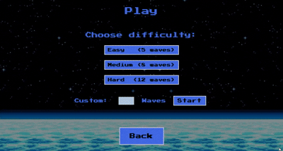
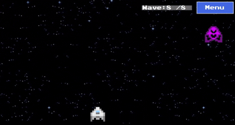
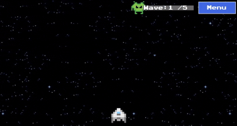

# 🚀 SpaceDefender Game

## 🎉 Introduction

Welcome to **SpaceDefender**! A fast-paced 2D space shooter where you defend Earth from waves of alien invaders.
This game features various alien types, including challenging bosses, with smooth animations and dynamic gameplay.

I’ve always enjoyed simple but engaging games, and I wanted to create something different from the grid-based games I had made before (like *Planes* and *Minesweeper*).  
SpaceDefender gave me the chance to develop a real-time collision system, handle complex enemy behaviors, and dive into fast-paced game programming, stepping out of my comfort zone.

This project was developed in **C# with Windows Forms** during my **Erasmus semester** in my **second year of university** as part of the **Programming in C# Language** course.

  
*Watch your trusty ship appear as the game starts!*

---

## 🌟 Features & Gameplay Highlights

* 🛸 **Multiple Alien Types:** Different enemies with unique movements and attack patterns.  
* 👾 **Boss Fights:** Face off against powerful alien bosses with special behaviors every few waves.  
  
*Face off with one of the bosses. They’re tough opponents! Their other abilities will remain a mystery. Are you ready to discover them?*  
* 🎯 **Dynamic Movement:** Enemies move down the screen with varied motion styles including strafing, sprinting and teleporting.  
* 🔊 **Sound Effects:** Immersive audio to enhance the action-packed gameplay.  
* 🎨 **Graphics:** Custom sprites and explosion animations.  
* 💥 **Game Over:** Ends when an alien reaches the bottom of the screen.  

---

## 🏆 Challenges & Learnings

The main challenges during development were:

* ⚙️ **Efficiency & Concurrency:** Making sure everything (enemy AI, background updates, bullets, and ship movement) ran smoothly and concurrently without lag, since this is a fast-paced game.
* 💥 **Collision Detection:** Building an accurate and performant collision system to manage interactions between bullets, enemies, and the player ship.
* 🎵 **Audio System:** Integrating sound effects in a way that didn’t interfere with gameplay performance.

Developing SpaceDefender was a rewarding experience where I:

* 🚀 Improved my understanding of real-time game mechanics and concurrency in C#.
* 🎮 Learned to design and optimize collision systems beyond simple grid-based logic.
* 💡 Pushed myself to create a more dynamic and challenging game compared to my previous projects.
* 🛠️ Gained practical experience with Windows Forms as a lightweight game rendering platform.

---

## ⚙️ Requirements

* Visual Studio with C# support
* .NET Framework compatible with Windows Forms

---

## 🚀 Installation

1. **Clone the repository:**

   ```bash
   git clone https://github.com/dosqas/spacedefender.git
   ```

2. **Open the project:**

   Open the `SpaceDefender.sln` file in Visual Studio.

3. **Build and run:**

   * **Important:** Set your display scaling to **125%** for the best visual experience! Otherwise graphics appear distorted.
   * Press **F5** to build and run the game.

---

## ▶️ How to Play

* Use the **Arrow keys** or **A/D** to move your spaceship left or right.  
* Press **Left Click** to shoot at incoming aliens.  
* Destroy enemies before they reach the bottom of the screen.  
  
*Experience fast-paced action as your ship moves, shoots, and takes down waves of alien invaders. Precision and timing are key to survival!*  
* Every few waves, a powerful boss will appear with new attack patterns.

---

## Known Issues

* Animations may stutter on low-end hardware.
* Visual and gameplay glitches occur if display scaling is not set to 125% prior to opening the app.

---

## Acknowledgements

* Thanks to the original creators of the alien sprites and sound effects used in this game.
* Inspired by classic space shooters and Windows Forms rendering techniques.

---

## 📄 License

This project is licensed under the MIT License. See the [LICENSE](LICENSE) file for details.

---

## 💡 Contact

Questions, feedback, or ideas? Reach out anytime at [sebastian.soptelea@proton.me](mailto:sebastian.soptelea@proton.me).